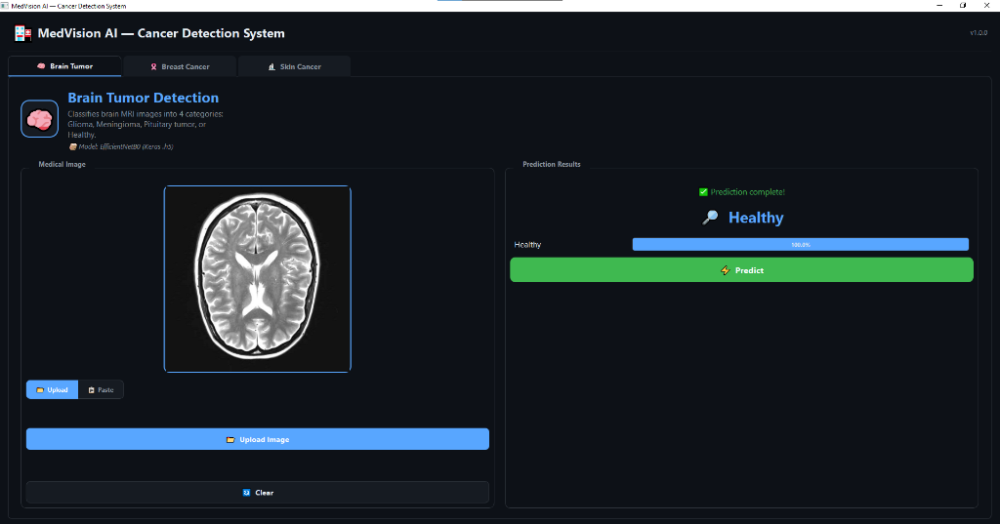
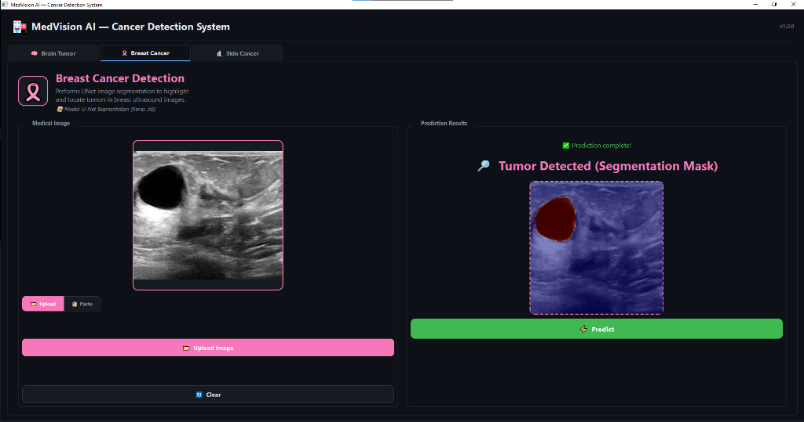
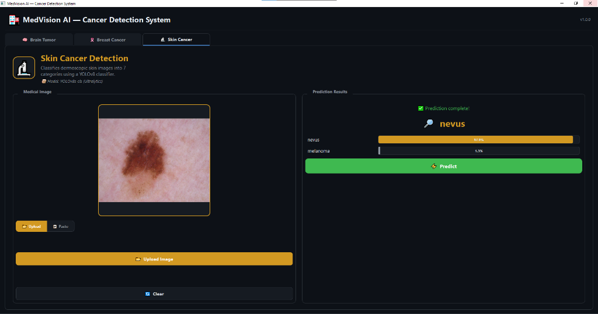
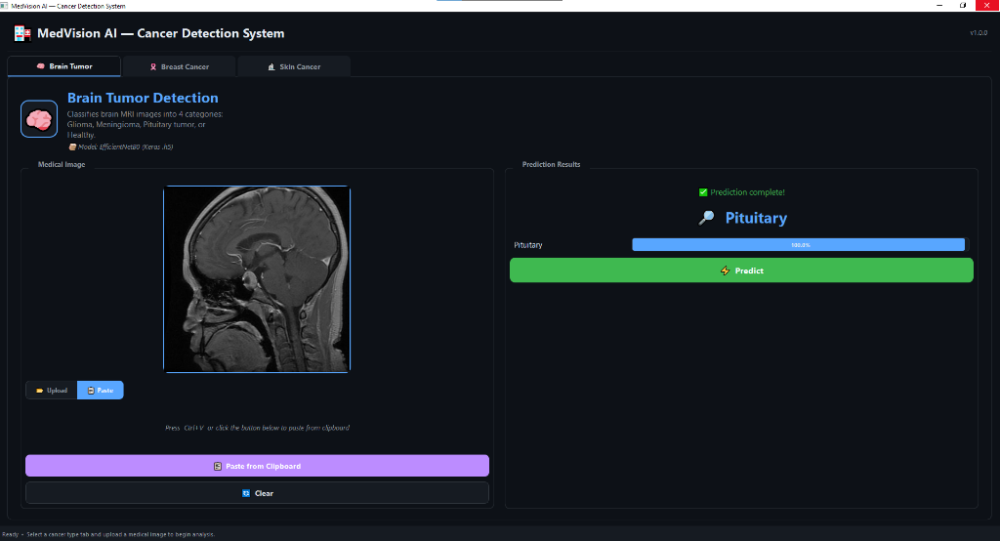
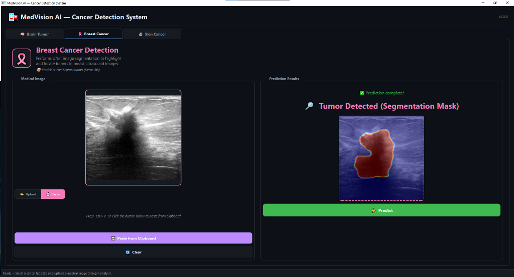
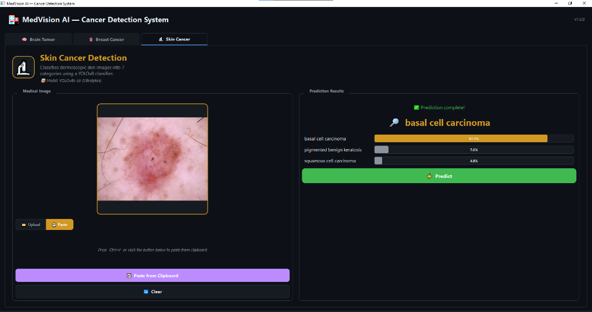

<p align="center">
  <h1 align="center">🏥 MedVision AI — Cancer Detection System</h1>
  <p align="center">
    A desktop AI-powered medical image analysis application for detecting <strong>Brain Tumors</strong>, <strong>Breast Cancer</strong>, and <strong>Skin Cancer</strong> using Deep Learning.
  </p>
  <p align="center">
    
    
    
    
    
  </p>
</p>

---

## 📸 Screenshots

<table>
  <tr>
    <td align="center"><strong>🧠 Brain Tumor Detection</strong></td>
    <td align="center"><strong>🎗️ Breast Cancer Segmentation</strong></td>
    <td align="center"><strong>🔬 Skin Cancer Classification</strong></td>
  </tr>
  <tr>
    <td></td>
    <td></td>
    <td></td>
  </tr>
  <tr>
    <td align="center"><strong>🧠 Brain Tumor Prediction</strong></td>
    <td align="center"><strong>🎗️ Breast Cancer Prediction</strong></td>
    <td align="center"><strong>🔬 Skin Cancer Prediction</strong></td>
  </tr>
  <tr>
    <td></td>
    <td></td>
    <td></td>
  </tr>
</table>

---

## 📋 Table of Contents

- [Overview](#-overview)
- [Features](#-features)
- [Models & Architecture](#-models--architecture)
- [Project Structure](#-project-structure)
- [Installation](#-installation)
- [Usage](#-usage)
- [Training Notebooks](#-training-notebooks)
- [Technologies Used](#-technologies-used)
- [Contributing](#-contributing)
- [License](#-license)

---

## 🔍 Overview

**MedVision AI** is a multi-modal medical image analysis desktop application built with **PyQt5**. It integrates three independently trained Deep Learning models to assist in the detection and classification of different cancer types from medical images:

| Cancer Type | Task | Model | Input |
|---|---|---|---|
| **Brain Tumor** | Classification (4 classes) | EfficientNetB0 | MRI scans |
| **Breast Cancer** | Segmentation (tumor mask) | U-Net | Ultrasound images |
| **Skin Cancer** | Classification (7 classes) | YOLOv8s-cls | Dermoscopic images |

> ⚠️ **Disclaimer**: This application is intended for **educational and research purposes only**. It is **NOT** a certified medical diagnostic tool and should not be used for clinical decision-making.

---

## ✨ Features

- 🧠 **Brain Tumor Detection** — Classifies brain MRI scans into: *Glioma*, *Meningioma*, *Pituitary Tumor*, or *Healthy*
- 🎗️ **Breast Cancer Segmentation** — Generates a U-Net segmentation mask highlighting potential tumors in breast ultrasound images
- 🔬 **Skin Cancer Classification** — Classifies dermoscopic images into 7 categories: *Basal Cell Carcinoma*, *Dermatofibroma*, *Melanoma*, *Nevus*, *Pigmented Benign Keratosis*, *Squamous Cell Carcinoma*, *Vascular Lesion*
- 🎨 **Modern Dark-Themed UI** — Sleek, professional medical-grade interface with tabbed navigation
- 📋 **Clipboard Paste Support** — Paste images directly from clipboard (Ctrl+V) in addition to file upload
- 📊 **Confidence Visualization** — Animated progress bars displaying per-class prediction confidence
- ⚡ **Threaded Inference** — Non-blocking prediction using background threads with a real-time loading spinner
- 🖥️ **High-DPI Support** — Scales properly on high-resolution displays

---

## 🧬 Models & Architecture

### 1. Brain Tumor — EfficientNetB0

| Property | Value |
|---|---|
| **Architecture** | EfficientNetB0 (Transfer Learning) |
| **Framework** | TensorFlow / Keras |
| **Input Size** | 224 × 224 × 3 |
| **Output** | 4 classes (Glioma, Healthy, Meningioma, Pituitary) |
| **File** | `Brain Tumor_EfficientNetB0/Brain Tumor_EfficientNetB0.h5` |

### 2. Breast Cancer — U-Net Segmentation

| Property | Value |
|---|---|
| **Architecture** | U-Net (Encoder-Decoder) |
| **Framework** | TensorFlow / Keras |
| **Input Size** | 128 × 128 × 1 (Grayscale) |
| **Output** | Segmentation mask (128 × 128) |
| **File** | `Breast Cancer U_Net/Breast Cancer U_Net.h5` |

### 3. Skin Cancer — YOLOv8s-cls

| Property | Value |
|---|---|
| **Architecture** | YOLOv8s-cls (Classification Head) |
| **Framework** | Ultralytics / PyTorch |
| **Input Size** | 224 × 224 |
| **Output** | 7 classes |
| **File** | `Skin_Cancer_yolo/skin_model.pt` |

---

## 📁 Project Structure

```
Cancer_Detection/
│
├── main.py                          # Main GUI application (PyQt5)
├── patch_models.py                  # Utility to patch .h5 models for Keras 3 compatibility
├── requirements.txt                 # Python dependencies
├── .gitignore                       # Git ignore rules
├── README.md                        # This file
│
├── Brain Tumor_EfficientNetB0/      # Brain tumor model & training notebook
│   ├── Brain Tumor_EfficientNetB0.h5
│   └── Brain_Tumor_EfficientNetB0.ipynb
│
├── Breast Cancer U_Net/             # Breast cancer model & training notebook
│   ├── Breast Cancer U_Net.h5
│   └── Breast_Cancer_U_Net.ipynb
│
├── Skin_Cancer_yolo/                # Skin cancer model & training notebook
│   ├── skin_model.pt
│   └── skin_isic_no_ak_sk_yolo_cls_notebook_(5).ipynb
│
└── screenshots/                     # Application screenshots
    ├── brain_tumor_prediction_1.png
    ├── brain_tumor_prediction_2.png
    ├── breast_cancer_prediction_1.png
    ├── breast_cancer_prediction_2.png
    ├── skin_cancer_prediction_1.png
    └── skin_cancer_prediction_2.png
```

---

## 🚀 Installation

### Prerequisites

- **Python 3.9+** (recommended: 3.10 or 3.11)
- **pip** package manager
- **Git** (to clone the repository)

### Steps

1. **Clone the repository**

   ```bash
   git clone https://github.com/YousefOsama20/Cancer_Detection.git
   cd Cancer_Detection
   ```

2. **Create a virtual environment** (recommended)

   ```bash
   python -m venv venv

   # Windows
   venv\Scripts\activate

   # macOS/Linux
   source venv/bin/activate
   ```

3. **Install dependencies**

   ```bash
   pip install -r requirements.txt
   ```

4. **Download model weights**

   The model weight files (`.h5` and `.pt`) are **not included** in the repository due to their large size. You must download them and place them in the corresponding directories:

   | Model | File | Directory | Size |
   |---|---|---|---|
   | Brain Tumor | `Brain Tumor_EfficientNetB0.h5` | `Brain Tumor_EfficientNetB0/` | ~47 MB |
   | Breast Cancer | `Breast Cancer U_Net.h5` | `Breast Cancer U_Net/` | ~355 MB |
   | Skin Cancer | `skin_model.pt` | `Skin_Cancer_yolo/` | ~10 MB |

   > 💡 **Tip**: You can train your own models using the Jupyter notebooks included in each model directory (see [Training Notebooks](#-training-notebooks)).

5. **(Optional) Patch models for Keras 3 compatibility**

   If you encounter Keras compatibility issues when loading the `.h5` model files, run:

   ```bash
   python patch_models.py
   ```

---

## 🖥️ Usage

### Run the application

```bash
python main.py
```

### How to use

1. **Select a cancer type** tab at the top of the window (*Brain Tumor*, *Breast Cancer*, or *Skin Cancer*)
2. **Upload an image** by clicking the "Upload Image" button, or **paste from clipboard** using `Ctrl+V`
3. **Click "Predict"** to run the AI model inference
4. **View results** — the predicted class and confidence scores are displayed in the results panel

### Supported image formats

`PNG`, `JPG`, `JPEG`, `BMP`, `TIFF`, `WebP`

---

## 📓 Training Notebooks

Each model directory includes a Jupyter Notebook documenting the full training pipeline:

| Notebook | Description |
|---|---|
| `Brain_Tumor_EfficientNetB0.ipynb` | Data loading, EfficientNetB0 transfer learning, training, and evaluation on brain MRI dataset |
| `Breast_Cancer_U_Net.ipynb` | Data preprocessing, U-Net architecture, training on breast ultrasound dataset, and segmentation evaluation |
| `skin_isic_no_ak_sk_yolo_cls_notebook_(5).ipynb` | ISIC dataset preprocessing, YOLOv8s-cls training, model evaluation, and testing on dermoscopic images |

---

## 🛠️ Technologies Used

| Technology | Purpose |
|---|---|
| **Python 3.9+** | Core programming language |
| **PyQt5** | Desktop GUI framework |
| **TensorFlow / Keras** | Brain Tumor & Breast Cancer models |
| **PyTorch** | Backend for YOLOv8 |
| **Ultralytics YOLOv8** | Skin Cancer classification model |
| **OpenCV** | Image preprocessing & segmentation overlay |
| **NumPy** | Numerical computations |
| **Pillow** | Image loading utilities |

---

## 🤝 Contributing

Contributions are welcome! If you'd like to contribute:

1. Fork the repository
2. Create a feature branch (`git checkout -b feature/YourFeature`)
3. Commit your changes (`git commit -m 'Add YourFeature'`)
4. Push to the branch (`git push origin feature/YourFeature`)
5. Open a Pull Request

---

## 📄 License

This project is licensed under the **MIT License** — see the [LICENSE](LICENSE) file for details.

---

## 👤 Author

**Yousef Osama**

- GitHub: [@YousefOsama20](https://github.com/YousefOsama20)

---

<p align="center">
  Made with ❤️ for medical AI research
</p>
